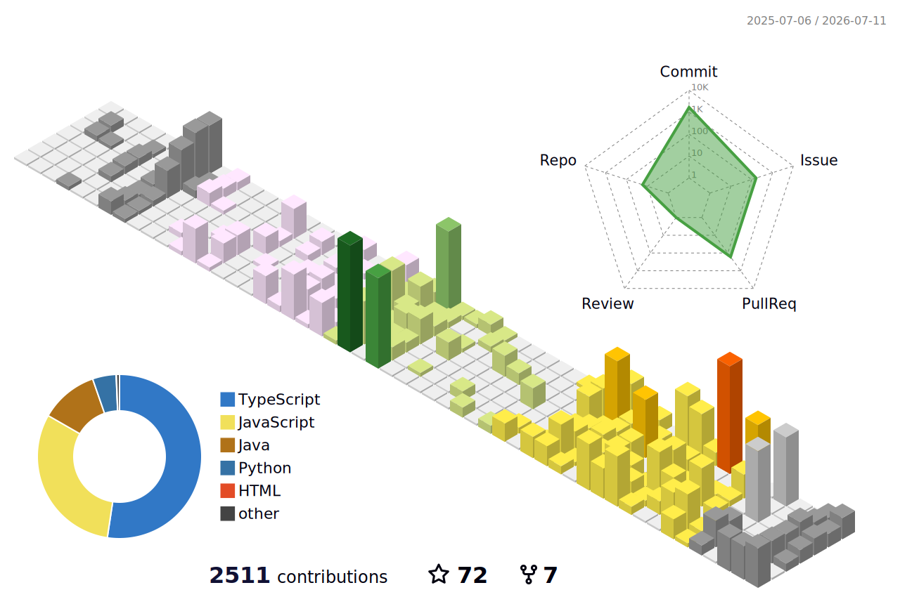

<h1 align="center">Hi, I'm Jaimin Detroja 👋</h1>

  

<h3 align="center">Full stack <i>Web & App DEV</i></h3>

---

### About me:

- ✨ I'm learning: Machine Learning 🤖🧠👨‍💻
- 😄 Fun fact: When I'm not debugging code, I'm calculating my next chess move ♟️️
- 📫 How to reach me: [officialjaimin345@gmail.com](mailto:officialjaimin345@gmail.com)
- 👁️ Show my [portfolio.jaimin-detroja.tech](https://portfolio.jaimin-detroja.tech/)
- 💬 Ask me about `Backend` | `Frontend` | `DSA` | `ML`

---

### Worked with:

 

---

### My Journey

   
  

---

### MY CONTRIBUTIONS

---

  <em><b>Connect with me on <a href="https://www.linkedin.com/in/jaimindetroja345">LinkedIn</a></b> :)</em>

